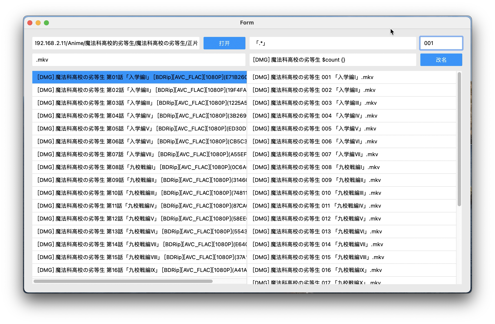
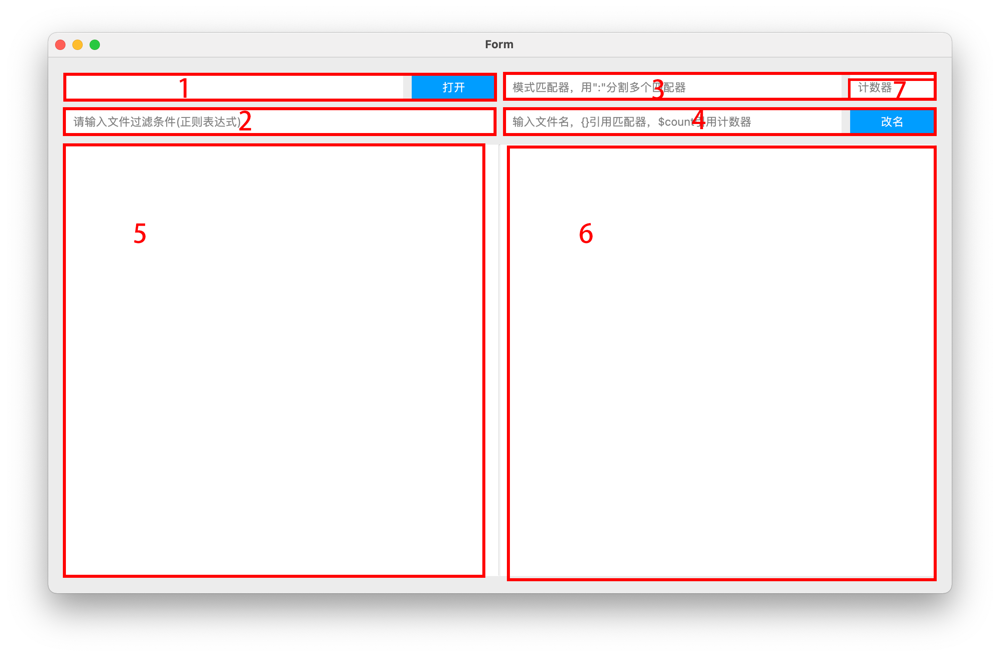

# 批量重命名文件
文件使用python+pyside2编写，需要windows版请自行编译
使用本软件可能需要正则表达式相关知识
## 使用效果

## 使用方法

### 1
打开要批量修改的文件所在的目录。也可以将文件夹拖拽到软件中。
### 2
过滤需要修改的文件。例如目录中有视频文件mkv和字幕文件ass，如果只需要修改视频文件的名字，则在过滤栏中输入`\.mkv$`。
过滤条件使用的是正则表达式。
### 3 
这里是可以输入正则表达式，以提取原文件名的部分内容，每个正则表达式被称为一个匹配器。可以输入多个匹配器，用冒号分隔。可以使用正则表达式的分组，在4中引用时会使用每个正则表达式的最后一个分组。
### 4
命名模式。命名模式由字符串/引用/计数器组成。  
字符串会原封不动的显式。  
`{}`表示引用，第i个`{}`会引用第i个匹配器提取的结果。`{}`是使用python的format函数实现，故可以使用format的格式化语法。  
计数器用`$count`表示，右上角7表示计数器格式。如果输入01，则表示计数器从1开始，填充2位。又如0011，表示计数器从11开始，填充4为。如果为空则默认从1开始填充2位。
### 5
待修改的文件列表。点击可以将文件名添加到4。
### 6
修改结果，和5一一对应。
## 编译方法
`pyinstaller -F -w app.py`
